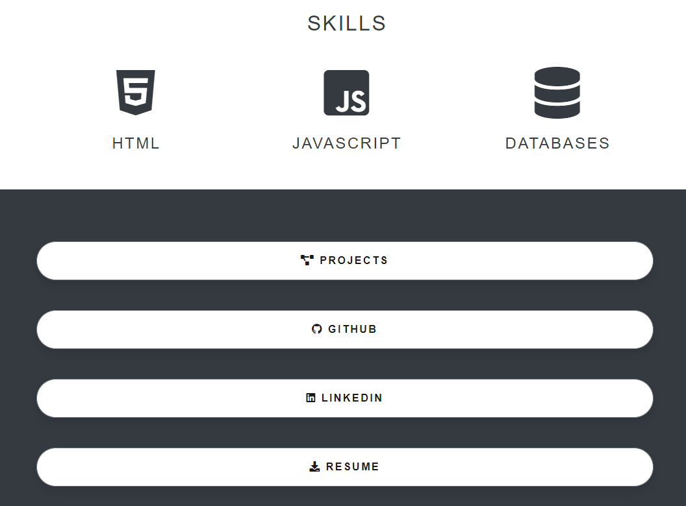

# Personal-Portfolio

https://kristenpicard.github.io/Personal-Portfolio/

## Description 

As I learn and grow as a developer, I wanted one place where I could showcase my projects and provide other developers and potential employers more information about who I am.

This project was created using solely HTML with CSS styling.

This page includes a small bio with a photo of me:
 

There is a section to list my skills as well as a list of buttons that take you to various documents and pages that give more information about me as a developer and professional:
 

I have a section listing ways to contact me:
 

When the "Projects" button is clicked, it takes you to another page showcasing three of my projects. Each project has a screenshot of the deployed page along with a link to its corresponding GitHub repository and a link to its live page.  
 

Each of the buttons on the main page take you to the corresponding elements in a new tab.

## Installation
Clone the repository at https://github.com/kristenpicard/Personal-Portfolio and load it on
code editor of your choice. Vscode is the prefered editor.

## Credits
Kristen Picard https://github.com/kristenpicard

## License
MIT License
